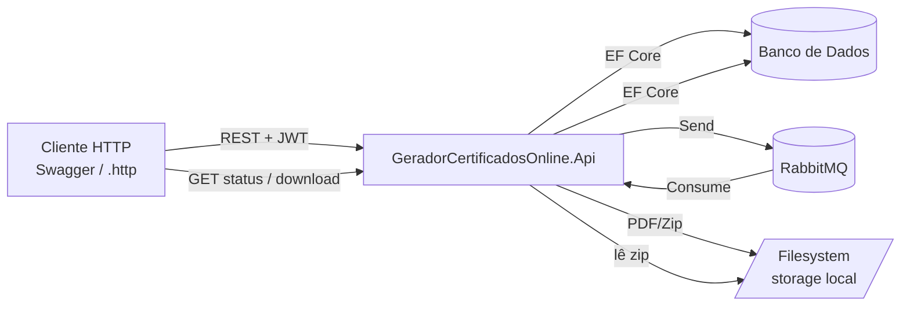
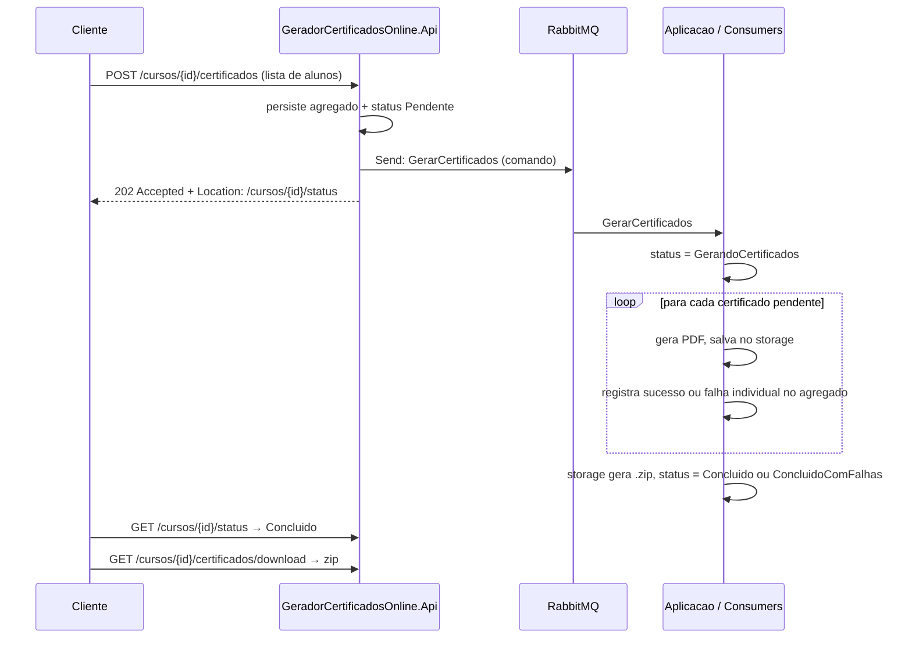
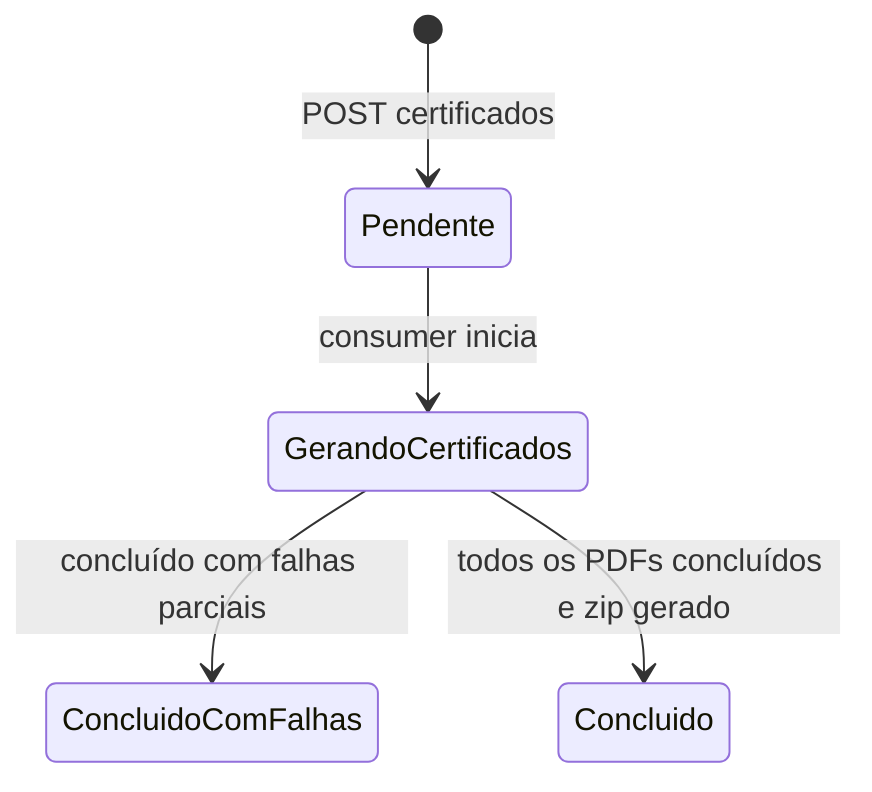

# TDD — API de Geração de Certificados (Projeto Didático de Arquitetura Orientada a Eventos)

| Campo            | Valor                                                        |
| ---------------- | ------------------------------------------------------------ |
| Projeto          | GeradorCertificadosOnline                                     |
| Tech Lead        | Alexandre                                                     |
| Time             | Alunos da turma (definir)                                     |
| Finalidade       | Projeto didático — Academia do Programador                    |
| Status           | Atualizada — envio de email removido                          |
| Criado           | 2026-09-14                                                    |
| Última alteração | 2026-09-14                                                    |
| Stack            | ASP.NET Core Web API (.NET 8+), SQL Server, RabbitMQ, MassTransit, JWT |

---

## 1. Contexto

Instituições de ensino precisam emitir certificados de conclusão para todos os alunos de um curso. A geração de PDFs e a compactação são operações **lentas e em lote** — exatamente o tipo de carga que não deve ser executada de forma síncrona dentro de uma requisição HTTP.

Este projeto usa esse cenário para ensinar **arquitetura orientada a eventos (EDA)** na prática: a API recebe solicitações, responde imediatamente com `202 Accepted` e delega o trabalho pesado para **consumers** que se comunicam via **RabbitMQ**, orquestrados pelo **MassTransit**.

**Domínio**: emissão de certificados (Curso → Alunos → Certificados → Zip).

**Stakeholders**: instrutor (Alexandre) e alunos da turma; não há usuários reais em produção.

## 2. Objetivos Didáticos

Ao final do projeto o aluno deve ser capaz de:

1. Enviar um **comando** (`Send`) para um consumer responsável pelo processamento do lote.
2. Implementar o padrão **request assíncrono** em REST: `202 Accepted` + endpoint de status (polling).
3. Processar um lote inteiro em uma única mensagem, mantendo o trabalho pesado fora da requisição HTTP.
4. Tratar falhas com **retry policy** e **fila de erro (dead-letter / `_error`)** do MassTransit.
5. Garantir **idempotência** em consumers (mensagens podem ser reentregues).
6. Observar filas, exchanges e mensagens no **RabbitMQ Management UI**.

## 3. Definição do Problema

- **Processamento pesado em requisição HTTP**: gerar dezenas de PDFs de forma síncrona causa timeout e péssima experiência — motiva o processamento assíncrono.
- **Falta de visibilidade**: o cliente precisa saber "onde está" o processamento — motiva o modelo de status consultável.

**Impacto de não usar EDA** (cenário-controle discutido em aula): timeouts e impossibilidade de escalar geração de PDF horizontalmente.

## 4. Escopo

### ✅ Dentro do escopo (V1)

- Cadastro de curso (síncrono, sem mensageria).
- Solicitação de geração de certificados para os alunos de um curso (assíncrono).
- Geração de 1 PDF por aluno via consumer, com layout fixo definido no código.
- Compactação (`.zip`) dos certificados ao concluir a geração.
- Consulta de status do processamento por curso.
- Listagem dos certificados de um curso, com o status individual de geração.
- Download do arquivo zip.
- Retry + fila de erro; idempotência básica.
- Autenticação via JSON Web Token (JWT Bearer): o login emite o token e os demais endpoints exigem token válido.
- Frontend: uso via Swagger e arquivos `.http` (sem aplicação web própria).

### ❌ Fora do escopo (V1)

- Gestão administrativa de usuários, refresh token e perfis de acesso (roles) continuam fora da V1. O cadastro público cria usuários no ASP.NET Core Identity.
- Saga / State Machine do MassTransit (fica para V2).
- Outbox pattern / consistência transacional DB+broker (discutido em aula, implementado na V2).
- Armazenamento em nuvem (Azure Blob) — V1 usa filesystem local.
- Templates customizáveis de certificado; assinatura digital; validação pública do certificado (QR Code).

### 🔮 V2+ (evoluções sugeridas)

- MassTransit **Saga State Machine** substituindo o contador de conclusão.
- **Transactional Outbox** do MassTransit (EF Core).
- Armazenamento em Azure Blob Storage + link temporário (SAS).
- Página pública de validação do certificado com código único.

## 5. Solução Técnica

### 5.1 Visão de Arquitetura

Uma API ASP.NET Core hospeda os handlers HTTP, o barramento MassTransit e os consumers de processamento, em uma única solution (`GeradorCertificadosOnline`) no mesmo repositório:

- **GeradorCertificadosOnline.Api** — ASP.NET Core Web API protegida por JWT: recebe requisições, hospeda o MassTransit, persiste dados, publica/envia mensagens e consulta status.
- **GeradorCertificadosOnline.Aplicacao** — casos de uso MediatR, contratos de mensagens e consumers MassTransit.
- **GeradorCertificadosOnline.Dominio** e **Infraestrutura** — regras de domínio, persistência, storage, geração de PDF e integrações externas.
- **RabbitMQ** — broker gerenciado no CloudAMQP (plano gratuito), com Management UI para inspeção.
- **Banco de dados** — SQL Server LocalDB (instalado com o Visual Studio) com EF Core.



### 5.2 Fluxo de Mensagens (coração didático do projeto)



### 5.3 Contratos de Mensagens

| Mensagem                     | Tipo    | Operação | Produtor | Consumidor                     | Payload principal                               |
| ---------------------------- | ------- | -------- | -------- | ------------------------------ | ----------------------------------------------- |
| `GerarCertificados`          | Comando | `Send`   | Api      | `GerarCertificadosConsumer`      | `CursoId`, `ProcessamentoId`                                      |

**Regras de contrato**: mensagens são imutáveis (records), carregam apenas dados necessários (nunca a entidade inteira do EF), e usam `ProcessamentoId` como identificação do lote; `CursoId` continua disponível para correlação funcional e storage.

### 5.4 Endpoints

> Rotas normalizadas em relação ao rascunho inicial: recurso no plural (`/cursos`), status e download como sub-recursos do curso — bom gancho de aula sobre design REST. Prefixo `/api/v1` opcional.

| Endpoint                                      | Método | Descrição                                   | Sucesso            | Erros                          |
| --------------------------------------------- | ------ | ------------------------------------------- | ------------------ | ------------------------------ |
| `/auth/cadastro`                              | POST   | Cria o usuário no Identity                  | `201 Created`      | `400` validação; `409` email já cadastrado |
| `/auth/login`                                 | POST   | Autentica o usuário e emite o JWT           | `200 OK` (token)   | `400` validação; `401` credenciais inválidas |
| `/cursos`                                     | POST   | Cadastra curso                              | `201 Created`      | `400` validação                |
| `/cursos/{cursoId}/certificados`              | POST   | Solicita geração p/ lista de alunos         | `202 Accepted` + `Location` | `404` curso; `409` já processando; `400` lista vazia |
| `/cursos/{cursoId}/certificados`              | GET    | Lista os certificados com status individual | `200 OK`           | `404` curso                    |
| `/cursos/{cursoId}/status`                    | GET    | Status do processamento                     | `200 OK`           | `404` curso                    |
| `/cursos/{cursoId}/certificados/download`     | GET    | Download do zip                             | `200 OK` (`application/zip`) | `404` curso; `409` não concluído |

**Autenticação**: exceto `POST /auth/cadastro` e `POST /auth/login`, todos os endpoints exigem o header `Authorization: Bearer {token}` (RN-09). No Swagger, o token é informado em **Authorize**; nos arquivos `.http`, por uma variável `@token`.

**Exemplos de contrato**:

```json
// POST /auth/cadastro
{ "email": "instrutor@exemplo.com", "senha": "Senha@123" }

// POST /auth/login
{ "email": "instrutor@exemplo.com", "senha": "********" }

// 200 OK
{ "usuarioId": "0198...", "accessToken": "eyJhbGciOiJIUzI1NiIs...", "dataExpiracaoEmUtc": "2026-09-16T13:00:00Z" }
```

```json
// POST /cursos
{ "nome": "Formação .NET", "cargaHoraria": 120, "dataConclusao": "2026-09-10" }

// 201 Created
{ "id": "c1a2...", "nome": "Formação .NET", "cargaHoraria": 120, "dataConclusao": "2026-09-10" }
```

```json
// POST /cursos/{cursoId}/certificados
{
  "alunos": [
    { "nome": "Maria Silva" },
    { "nome": "João Souza" }
  ]
}

// 202 Accepted  (header Location: /cursos/{cursoId}/status)
{ "cursoId": "c1a2...", "totalAlunos": 2, "status": "Pendente" }
```

```json
// GET /cursos/{cursoId}/certificados — 200 OK
[
  { "id": "7b1e...", "nomeAluno": "Maria Silva", "statusGeracao": "Gerado", "geradoEm": "2026-09-14T14:01:12Z" },
  { "id": "9c4d...", "nomeAluno": "João Souza",  "statusGeracao": "Falha",  "geradoEm": null }
]
```

```json
// GET /cursos/{cursoId}/status — 200 OK
{
  "cursoId": "c1a2...",
  "status": "GerandoCertificados",
  "totalCertificados": 30,
  "gerados": 22,
  "falhas": 1,
  "zipDisponivel": false,
  "iniciadoEm": "2026-09-14T14:00:00Z",
  "concluidoEm": null
}
```

### 5.5 Máquina de Estados do Processamento



Por certificado individual: `Pendente → Gerado | Falha`.

### 5.6 Modelo de Dados

- **Curso**: `Id (guid)`, `Nome`, `CargaHoraria`, `DataConclusao`, `CriadoEm`.
- **Certificado**: `Id (guid)`, `ProcessamentoId (FK)`, `NomeAluno`, `StatusGeracao`, `CaminhoArquivo`, `GeradoEm`. Cada certificado pertence a um `ProcessamentoCertificados`.
- **ProcessamentoCertificados**: `Id (PK)`, `CursoId (FK)`, `Certificados (1:N)`, `Status`, `CaminhoZip`, `IniciadoEm`, `ConcluidoEm`. Os totais do status são calculados pela coleção de certificados. Um curso pode ter vários registros finalizados, mas apenas um com status não finalizado.

Índices: `Certificado(ProcessamentoId, StatusGeracao)`, índice único filtrado `ProcessamentoCertificados(CursoId)` para os status `Pendente` e `GerandoCertificados`.

### 5.7 Decisões Técnicas

| Decisão | Escolha | Justificativa |
| ------- | ------- | ------------- |
| Broker | RabbitMQ no CloudAMQP (plano gratuito) | Requisito da disciplina; sem instalação local e com Management UI, excelente para didática |
| Abstração de mensageria | MassTransit | Requisito; convenções de topologia, retry e `_error` queue prontas |
| Geração de PDF | QuestPDF | API fluente em C#, licença Community adequada a uso educacional |
| Layout do certificado | Template fixo no código (QuestPDF) | Suficiente para a V1; templates customizáveis ficam fora do escopo |
| Zip | `System.IO.Compression` (nativo) | Zero dependências |
| Storage | Filesystem local em `Environment.SpecialFolder.LocalApplicationData` | Evita gravar arquivos na pasta do projeto; as pastas `GeradorCertificadosOnline/storage` são constantes na implementação; caminho abstraído atrás de interface p/ trocar por Blob na V2 |
| Agregação de conclusão | `ProcessamentoCertificados` como agregado único | Evita eventos intermediários e mantém resultados, contadores e ZIP em uma única persistência |
| Autenticação | ASP.NET Core Identity para persistência e validação de credenciais, com JWT Bearer (`Microsoft.AspNetCore.Authentication.JwtBearer`) emitido por `POST /auth/login` | Padrão para APIs REST, sem provedor externo; somente a chave de assinatura fica em user-secrets, fora do repositório |
| Persistência | SQL Server LocalDB + EF Core (migrations) | Padrão da turma no ecossistema .NET; o LocalDB já vem com o Visual Studio |
| Repositório | Api, Aplicacao, Dominio e Infraestrutura no mesmo repositório, em uma única solution | Um contrato, um consumer e um repositório agregado; um único build e setup para a turma |
| Ambiente | Sem Docker: LocalDB + CloudAMQP | Nada para instalar além do .NET SDK e do Visual Studio |

## 6. Requisitos

### Requisitos Funcionais

- **RF-01** — Cadastrar curso com nome, carga horária e data de conclusão.
- **RF-02** — Solicitar geração de certificados informando a lista de alunos (nome) de um curso.
- **RF-03** — Gerar um PDF de certificado por aluno, contendo nome do aluno, nome do curso, carga horária e data de conclusão.
- **RF-04** — Consultar o status do processamento de um curso (contadores de gerados/falhas e estado geral).
- **RF-05** — Gerar arquivo zip com todos os certificados do curso ao final da geração.
- **RF-06** — Disponibilizar download do zip.
- **RF-07** — Listar os certificados de um curso com o status individual de geração.

### Regras de Negócio

- **RN-01** — A solicitação de certificados retorna `202 Accepted`; nenhum PDF é gerado dentro da requisição HTTP.
- **RN-02** — Curso com processamento em andamento não aceita nova solicitação (`409 Conflict`).
- **RN-03** — Download só é permitido com status `Concluido` ou `ConcluidoComFalhas` (`409` caso contrário).
- **RN-05** — O consumer deve ser **idempotente**: certificados `Gerado` ou `Falha` e lotes finalizados são ignorados em reentregas.
- **RN-06** — Falha na geração de um certificado não interrompe os demais; o lote conclui como `ConcluidoComFalhas`.
- **RN-07** — Toda mensagem consumida com erro após esgotar os retries vai para a fila `_error` correspondente (não é descartada).
- **RN-08** — A lista de alunos deve ter ao menos 1 aluno, com nome válido (`400` caso contrário).
- **RN-09** — Todos os endpoints, exceto `POST /auth/cadastro` e `POST /auth/login`, exigem um JWT válido (`401 Unauthorized` caso contrário).

## 7. Tratamento de Falhas e Idempotência

- **Retry policy** (MassTransit): 3 tentativas com intervalo incremental (ex.: 5s, 15s, 30s) para falhas estruturais do processamento.
- **Falhas individuais**: erros de geração/gravação de um certificado são registrados no agregado e não interrompem o lote.
- **Fila de erro**: mensagens esgotadas caem em `{fila}_error`; exercício de aula: inspecionar no Management UI e reprocessar via *shovel*.
- **Idempotência**: chave natural = `ProcessamentoId` + `CertificadoId`; consumer verifica o status do lote e de cada certificado antes de gerar.

## 8. Riscos

| Risco | Impacto | Probabilidade | Mitigação |
| ----- | ------- | ------------- | --------- |
| Alunos perderem-se na topologia do RabbitMQ (exchanges/filas geradas por convenção) | Médio | Alta | Aula dedicada ao Management UI; nomear consumers/filas explicitamente |
| Falha parcial interromper o lote | Alto (status nunca conclui) | Média | Resultado individual no agregado e teste com falha proposital |
| Publicar mensagem e falhar o commit no banco (dual write) | Médio | Média | Ordem: persistir → publicar; documentar limitação e apontar Outbox (V2) |
| Zip gerado antes do último PDF (agregação incorreta) | Alto | Média | Zip só é criado quando todos os certificados têm resultado |
| Ambiente heterogêneo entre máquinas dos alunos | Médio | Média | Sem Docker: LocalDB (vem com o Visual Studio) e CloudAMQP; README de setup (inclui a configuração dos user-secrets) |
| Falta de internet ou limites do plano gratuito do CloudAMQP durante a aula | Médio | Baixa | Uma instância por aluno; lotes de teste de tamanho moderado; acompanhar o consumo no painel do CloudAMQP |
| Licenciamento de lib de PDF | Baixo | Baixa | QuestPDF Community (uso educacional) |

## 9. Estratégia de Testes

- **Unitários**: regras de negócio (validações, transições de status, montagem do certificado).
- **Consumer**: `MassTransit.TestFramework` com **test harness** em memória — verifica processamento do lote, falha individual, ZIP e idempotência.
- **Integração**: fluxo completo com RabbitMQ (CloudAMQP) e SQL Server (LocalDB) reais, autenticado via `POST /auth/login` — do `POST /certificados` até `Concluido`.
- **Cenários críticos**: lote com 1 aluno; lote grande; falha proposital em 1 PDF (`ConcluidoComFalhas`); mensagem duplicada ou reentregue; requisição sem token ou com token expirado (`401`).

## 10. Plano de Implementação (fases ≈ blocos de aula)

| Fase | Entrega | Conteúdo didático |
| ---- | ------- | ----------------- |
| **1 — Setup** | Solution `GeradorCertificadosOnline` (Api, Aplicacao, Dominio e Infraestrutura) no mesmo repositório, ambiente sem Docker (LocalDB e CloudAMQP), EF Core migrations | Estrutura de solução; ambiente |
| **2 — CRUD síncrono + JWT** | `POST /auth/login`, `POST /cursos` protegido, arquivos `.http` | Baseline sem mensageria; autenticação JWT Bearer |
| **3 — Comando único** | `POST /certificados` + `GerarCertificadosConsumer` | Send, retry e idempotência |
| **4 — PDF e agregado** | QuestPDF + storage + resultados individuais | Falha parcial sem interromper lote |
| **5 — Zip e download** | agregado concluído → zip → `GET /download` | Storage e polling REST |
| **8 — Resiliência** | Retry, `_error`, idempotência, cenários de caos | O "porquê" da EDA |

## 11. Questões em Aberto

- [x] Nome do projeto/solution: **GeradorCertificadosOnline**.
- [x] Banco: **SQL Server**.
- [x] API e consumers: **mesmo processo, com mensageria configurada na Aplicacao**.
- [x] Endpoint `GET /cursos/{cursoId}/certificados`: **incluído** (5.4, RF-09).
- [x] Layout do certificado: **template fixo no código**.
- [x] Cadastro no Identity e emissão do JWT: **`POST /auth/cadastro` cria o usuário e `POST /auth/login` retorna o token**.
